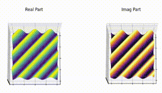
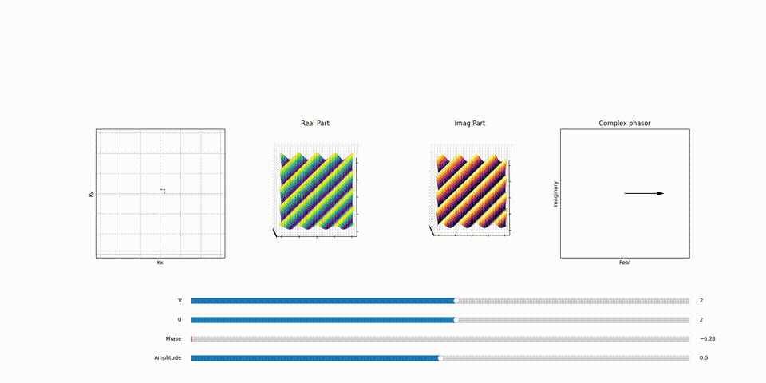

## The 2D Fourier Transform in Imaging

The 2D Fourier Transform extends the principles of the 1D transform to two dimensions:

$$F(k_x, k_y) = \int_{-\infty}^{\infty} \int_{-\infty}^{\infty} f(x, y) e^{-2\pi i(k_xx + k_yy)} \, dx \, dy$$

Here, $f(x, y)$ is the spatial signal (image), while $k_x$ and $k_y$ represent spatial frequencies in the x and y directions, respectively. This transform decomposes an image into its frequency components, revealing how different spatial frequencies and orientations contribute to the overall image.

now $F(k_x, k_y)$, unlike $F(\omega)$ in 1D fourier transform,  is a 2D plane where these spatial frequencies are organized thus, each point in this plane maps to a specific spatial frequency within the object. This concept parallels the 1D Fourier transform, but extends it to a 2D framework. Here, we deal with 2D spatial coordinates (x, y) and corresponding 2D spatial frequency coordinates $(k_x, k_y )$ and each point in this plane, just like in $F(\omega)$, has its own complex plane containing withinin a phasor that scales and shifts this 2D sinosoid. This spatial frequency information is critical in reconstructing the final MRI image.

upon adding all these scale and shifted 2D sinosoids we get the final 2D image just like we did in 1D fourier transform.

## OK but how exactly does a 2D sinosoid look?

In $F(k_x, k_y)$ plane stepping through the $k_x$ and $k_y$ coordinates creates 2D sinosoids  with varying 'wiggles' in x and y directions.

Understanding the appearance and behavior of 2D sinusoids in the context of the Fourier Transform requires a closer look at the $F(k_x, k_y)$ plane. In this plane, navigating through various $k_x$ and $k_y$ coordinates generates a series of 2D sinusoids, each characterized by distinct patterns or 'wiggles' in both the x and y directions.

### The Influence of $k_x$ and $k_y$ on Sinusoidal Patterns

Imagine a coded animation, similar to the one in the 1D Fourier transform blog, to better visualize this concept. As you increment the value of $k_x$, you'll notice an increase in the frequency of wiggles along the x-direction. Similarly, increasing $k_y$ boosts the frequency of wiggles in the y-direction. This relationship is key to understanding how 2D sinusoids are formed and manipulated in Fourier space.

Each 2D sinusoid is  shaped by a corresponding phasor. This phasor adjusts both the amplitude and phase of the sinusoid. The resultant effect is a versatile range of sinusoidal waves, each uniquely contributing to the overall image reconstruction process in MRI.

The number of wiggles or oscillations in each direction correlates directly to a specific point in the $F(k_x, k_y)$ plane. For instance, a sinusoid with 3 complete cycles  in the x-direction and 3 in the y-direction would correspond to a point in $F(k_x, k_y)$ with $k_x =3$ value and $k_y =3$ value. This mapping is fundamental to how spatial frequencies are represented and manipulated in the Fourier Transform, particularly in applications like MRI, where precise spatial information is crucial.

 <figcaption>Fig 1: 2D Sinosoid with changing phase  </figcaption>

Here's a part of animation that demonstrates the relation between point in $F(k_x, k_y)$ plane and the 2D sinosoid it generates and the effect of phasor assosiated with each of the 2D sinosoid (spatical frequency) and how it scales and shifts the it.

 <figcaption>Fig 2: 2D Sinosoid with changing phase  </figcaption>

## Bonus Lesson:

If you keep on increasing the cycles in either direction  $k_x$ or $k_y$ [ V , U]  you'll notice that the higher frequncy 2D sinosoid starts to look like a lower frequency 2D sinosoid.
**Hint:** 
* It has to do with the number of point i am sampling to create the 2D sinosoid and nyquist frequency:D

# References
1. [The Fourier Theory in MRI ](https://youtu.be/R_4GuyJTzMo?t=350)
